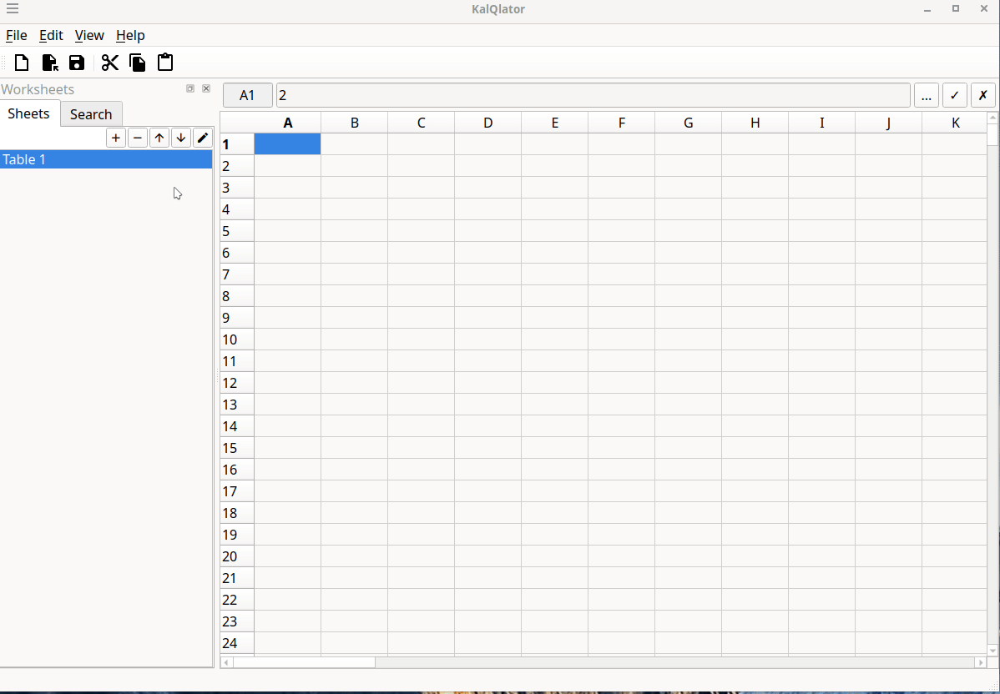

# KalQlator

A simple spread sheet application which uses a Lisp-inspired language interpreter for its formulas.



This is a pure hobby project.

I created a similar project before using wxWidgets. You can find it here: https://github.com/pderichs/kalkulator.

## How to build

### Prerequisites

Qt 6 development libraries are required to build this project.

For e.g. Debian based systems you can use

```bash
sudo apt install \                                                                                                                           2 ↵
  qt6-base-dev \
  qt6-base-dev-tools \
  qt6-tools-dev \
  qt6-tools-dev-tools \
  libqt6test6 
```

### Build

```bash
mise install # optional - tools can be installed manually as well
mkdir build && cd build
cmake ..
make -j$(nproc)
```

## Run Tests

```bash
cd build
ctest --output-on-failure
```

## Built With

KalQlator uses Open Source Software:

- **[Qt](https://www.qt.io/)** – Cross-platform Application Framework
- **[Material Icons Font](https://fonts.google.com/icons)** – Icons

Please see their respective Licenses for more information.

## License

This project is licensed under the [GNU General Public License v3.0](https://www.gnu.org/licenses/gpl-3.0) – see the [LICENSE](LICENSE) file for details.

This project uses the Qt Framework (https://www.qt.io).
Qt modules used in this project are licensed under the GNU Lesser General
Public License v3.0 (LGPLv3).
See: https://www.gnu.org/licenses/lgpl-3.0.html

This project uses Material Icons Font (https://fonts.google.com/icons)  
by Google, licensed under the [Apache License 2.0](https://www.apache.org/licenses/LICENSE-2.0).